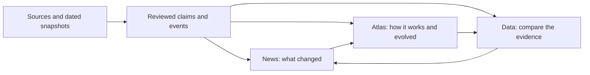

# VISUALIZE-SH: News, Atlas, and Data

> Design history: use `docs/LOCAL_IMPLEMENTATION_STATUS.md` for the current
> implementation record and `docs/HANDOFF.md` for contributor instructions.

Planning proposal · Research conducted September 20–21, 2026 · No application or database migration performed

## 1. The product to build

**Make VISUALIZE-SH a source-linked explanation of how structural-heart technologies work, what the evidence establishes, and how products and indications evolve.** The newsletter is the recurring entry point; the Atlas is the durable reference; Data lets readers inspect and compare the evidence.

The recurring question should be: **What changed, why could it matter mechanically or clinically, and what evidence supports that interpretation?**

The strongest differentiator is the connection between four things:

1. **Design and materials:** the engineered mechanism, its constraints, and its tradeoffs.
2. **Patient and anatomy fit:** the population, anatomy, workflow, and conditions under which it is intended or studied to work.
3. **Evidence:** the exact device version, cohort, comparator, endpoint, follow-up, effect, and uncertainty.
4. **Evolution:** what changed in the product, manufacturing, software, labeling, or evidence—and whether those changes are actually linked.

These are four tracking bundles, not four scalar fields. The user-facing profile stays compact; the underlying observations preserve enough context to make comparisons defensible.

**Working audience:** device R&D, design, simulation, and clinical-development teams, with visual explanations accessible to structural-heart clinicians. **Working pilot:** TAVR. These are provisional choices pending reader/focus feedback, not confirmed preferences. Keep the existing wider structural-heart coverage, but apply deep curation first to a bounded collection.

## 2. What the publication review changes about the strategy

This was a targeted competitive and scientific literature review, not a systematic review or an exhaustive audit of paid databases. It combined first-party publication/product pages, original studies, FDA records and documentation, ClinicalTrials.gov documentation, the earlier ChatGPT discussion, and the current repository. The existing Chrome/ProQuest session provided full-text access to a detailed crimping-model paper and cross-journal discovery. Access and completeness varied; a citation or abstract was not treated as a full-text review.

### Competitive landscape

| Publication or product | Relevant observed offering | Consequence for VISUALIZE-SH |
|---|---|---|
| [The Valve Wire](https://www.thevalvewire.com/) and its [trial dashboard](https://www.thevalvewire.com/trials) | Structural-heart digest, topic coverage, trial status/enrollment/completion tracking, and materials/regulatory stories. | Closest direct overlap. News aggregation, materials summaries, and a registry tracker are insufficient differentiation by themselves. |
| [TCTMD](https://www.tctmd.com/) | Clinical/conference reporting, expert interpretation, interviews, features, and educational content. | Use for discovery and clinical context; build persistent technical records that readers can revisit after a news cycle. |
| [PCRonline / EuroIntervention](https://www.pcronline.com/PCR-Publications) | Trials resources, textbooks, peer-reviewed research, cases, procedural education, and congress material. | Detailed procedural and device discussion already exists. Normalize it into versioned comparisons rather than claiming engineering is entirely uncovered. |
| [Structural Heart](https://www.structuralheartjournal.org/) | Dedicated heart-team research spanning structural conditions, interventions, and device innovation. | A primary evidence source and potential venue for deeper reference material. |
| [Heart Valve Society literature updates](https://heartvalvesociety.org/VHD/) and [JHVS](https://journals.sagepub.com/home/hvs) | Valve-focused literature discovery and basic, translational, and clinical research. | A curated reading list is useful but readily replicated. Add extraction, interpretation, and maintained evidence histories. |
| [Cardiovascular Business](https://cardiovascularbusiness.com/topics/clinical/structural-heart-disease) | Structural-heart clinical, operational, economic, and industry reporting. | Include adoption context where it changes technology use; keep the core technical promise clear. |
| [Cardiovascular News](https://cardiovascularnews.com/news/) | Trials, approvals, funding, congresses, first-patient announcements, and print/newsletter coverage. | Convert announcements into changes to a known product or trial record. |
| [MedTech Dive](https://www.medtechdive.com/topic/cardiac/) | Cardiac business, FDA, recall, earnings, and strategic reporting. | Strong discovery source; broad business coverage is not the initial competitive advantage. |
| [MassDevice](https://www.massdevice.com/massdevices-transcatheter-heart-valves-special-report/) | News plus a transcatheter-valve special report covering technology, companies, markets, and competitive dynamics. | Even comparative market reports are occupied territory. The opportunity is technical specificity, evidence traceability, and maintenance over time. |
| [Fierce Medtech](https://www.fiercebiotech.com/medtech) | Device development, studies, regulation, safety, and transactions. | Use event reporting to initiate primary-source verification. |
| [MedTech Strategist](https://www.mystrategist.com/) | Subscription business, startup, regulatory, reimbursement, and policy intelligence. | Avoid a promise of comprehensive commercial intelligence without a corresponding research operation. |
| [DeviceTalks](https://www.devicetalks.com/about/) | Product-development, manufacturing, leadership, and business interviews, podcasts, and events. | Useful design rationale, but interview statements remain attributed claims until corroborated. |
| [STAT medical-device coverage](https://www.statnews.com/topic/medical-devices/) | Investigative and explanatory reporting on devices, regulation, safety, payment, and adoption. | Evidence quality and commercial context matter alongside engineering. |
| [GlobalData pipeline database](https://www.globaldata.com/product/medical-devices-pipeline-products-database/) | Broad commercial pipeline intelligence and structured delivery. | Compete on a narrow technical domain and transparent sources; do not promise comparable global completeness initially. |

The defensible conclusion is a **plausible opportunity in the maintained connection between engineering, exact product generations, indications, and clinical evidence**. This scan cannot establish that no competitor offers these features privately. The Valve Wire's [materials article](https://thevalvewire.com/article/2026-09-08/innovation-and-challenges-in-materials-for-transcatheter-aortic-valves) makes the overlap concrete. Its retrieved dashboard snapshots had different dates and counts, so its current inventory size is deliberately not used as a positioning claim.

### Scientific literature: findings that should determine the schema

| Source and evidence type | What is useful for the product | What to curate or avoid inferring |
|---|---|---|
| [Bressloff, 2022, full-device crimping simulation](https://doi.org/10.1007/s13239-022-00614-6), full text examined through ProQuest | The modeled frame, skirt, leaflet properties, contacts, and crimp procedure all affect interpretation. The author states that mesh verification was not undertaken and discusses generalizability limits. | Record model provenance, material law, loading, mesh verification, validation, and limitations. This was a research design mixing features; its dimensions must not become specifications of a marketed valve. |
| [Alavi et al., 2014, leaflet microscopy after crimping](https://pubmed.ncbi.nlm.nih.gov/24444873/), original experimental study | Crimping produced persistent structural tissue damage under the studied conditions. | Capture tissue, crimp diameter, duration, method, and measured damage. A tissue-damage finding does not establish a clinical durability penalty for every commercial valve. |
| [Kiefer et al., 2011, crimping and subcutaneous rat study](https://pubmed.ncbi.nlm.nih.gov/21718842/), original preclinical study | Structural fragmentation differed, but calcification did not differ between the studied groups. | Separate structural damage, calcification, and clinical valve failure as distinct outcomes; preserve experimental context and apparently conflicting evidence. |
| [PRECISE-TAVI, 2023](https://pubmed.ncbi.nlm.nih.gov/37668110/), clinical simulation study | Simulations changed plans in some challenging anatomies and related modeled contact pressure to pacemaker implantation. | Distinguish prediction, changed operator behavior, and proven patient benefit. Record anatomy selection and observational limitations. |
| [Carr et al., 2026, nitinol uncertainty quantification](https://pubmed.ncbi.nlm.nih.gov/42082881/), original computational/experimental research | Choice of input distribution affected output uncertainty and extreme-event interpretation. Harshad Paranjape is among the authors. | A concrete foundation for a simulation-credibility editorial series. This research used an IVC-filter context/surrogate, not a marketed heart valve; transfer the reasoning, not its numerical findings. |
| [TRILUMINATE Pivotal, 2023](https://pubmed.ncbi.nlm.nih.gov/36876753/), randomized trial | The initial 350-patient report used a hierarchical composite; its one-year result must be interpreted with its component outcomes. | Do not translate a favorable win ratio into a mortality benefit. Store endpoint hierarchy and component results. |
| [TRILUMINATE full randomized cohort](https://pubmed.ncbi.nlm.nih.gov/39471883/) and [two-year report](https://pubmed.ncbi.nlm.nih.gov/40159089/) | Later publications report 572 randomized participants and different follow-up. The two-year report found fewer recurrent HF hospitalizations; mortality was similar. | Separate cohort and follow-up versions. Preserve the original one-year finding and add the later finding instead of overwriting one trial summary. |
| [PREDICT-LAA final report, 2023](https://doi.org/10.1016/j.jcin.2023.01.008), randomized simulation-planning study | Procedural benefits and a statistically inconclusive primary composite coexist. | Track primary and secondary endpoints, randomized and evaluable populations, exact device, and software intervention separately. |
| [VITAL-HF](https://pubmed.ncbi.nlm.nih.gov/41939727/), randomized digital-care study | The intervention combines digital infrastructure, health coaches, and clinician-directed treatment plans. | Attribute outcomes to the evaluated care package; do not assign the effect exclusively to an algorithm. |
| [Hello Heart cohort study](https://pubmed.ncbi.nlm.nih.gov/34652447/), observational study | Connected BP monitoring and digital self-management can be studied with longitudinal engagement and BP measurements. | Preserve selection, missingness, follow-up denominators, and engagement confounding. This is adjacent HF/cardiovascular evidence, not direct proof in a valve population. |

Use the published endpoint definitions in [VARC-3](https://pubmed.ncbi.nlm.nih.gov/33871579/), [MVARC](https://doi.org/10.1016/j.jacc.2015.05.049), and [TVARC](https://pubmed.ncbi.nlm.nih.gov/37804294/) as controlled references. Save the edition/definition actually used by each study; do not retrospectively relabel every older result as using the newest standard. For AI interventions, [SPIRIT-AI](https://www.bmj.com/content/370/bmj.m3210) provides useful protocol-reporting fields, including the algorithm and its interaction with users.

## 3. The three application modes

Make these three full work surfaces sharing the same records. The existing News/Atlas switch primarily changes the sidebar while retaining the graph. The proposed modes should have different primary tasks and layouts.

| Mode | Reader question | Main surface | Useful interactions |
|---|---|---|---|
| **News** | What changed, and why does it matter? | Curated feed and issue pages, with a prominent visual analysis when available. | Filter by topic/change type; open the affected version; inspect the data behind a claim; show previous versus new state. |
| **Atlas** | How does this therapy work, and where does it fit? | Condition → treatment strategy → product family → version profiles. Cards/list are available alongside the existing graph. | Component/material view, anatomy fit, evidence map, generation history, exact-label history, and linked news. |
| **Data** | What supports a comparison? | Tables first, with focused charts and downloadable curated snapshots. | Select compatible populations/timepoints; compare versions; open source evidence for any cell; inspect missingness and changes. |

Keep condition, selected products, jurisdiction, and historical date consistent across modes. Shareable URL state should reopen the same comparison without requiring an account. For the existing static hosting setup, hash routes are a practical implementation option; a routing rewrite is not necessary just to introduce these modes.



### News structure

Each substantive item contains: event date, publication date, affected product/version or cohort, the new fact, why it matters, evidence boundary, and a link to the changed Atlas/Data record. Multiple news articles about one FDA decision should resolve to one event with several sources.

Recommended filters: **Design/materials · Clinical readout · Trial amendment · Indication/IFU · Manufacturing · Software · Safety · Company**. Company events deserve space when they change a program, product, or access to therapy.

A source announcement can enter the draft event queue immediately. Publication of a scientific interpretation waits for review; an announcement alone does not silently update a clinical claim.

### Atlas profile structure

The first screen shows the four tracking bundles, with the exact selected version, jurisdiction, and last review date. The profile then offers **Design**, **Fit**, **Evidence**, and **History** sections. A source drawer exposes supporting documents and precise locations. A family profile groups versions; a version profile does not inherit clinical results automatically.

The graph remains particularly useful for disease–mechanism–device–trial relationships. Avoid putting every endpoint, label revision, and source document on the default graph; expose those when a reader drills into a profile.

### Data launch views

Launch with three purposeful tables, not a generic spreadsheet of all fields:

1. **Device design comparison:** components/materials, architecture, delivery and sizing, source quality, generation changes.
2. **Trial evidence comparison:** population, actual/estimated enrollment, comparator, primary endpoint, component outcomes, effect with uncertainty, follow-up, and version tested.
3. **Indication and version history:** FDA decision, affected models, old/new eligibility, hardware/software/manufacturing changes, supporting trial, IFU documents.

Add a digital workflow/evidence comparison once the same schema has been tested on a small digital collection. Every export should retain units, cohort, timepoint, source, and dataset version.

## 4. The four things to curate for each kind of record

### Physical device: the mandatory profile

| Bundle | Minimum useful content | Deeper fields when publicly available |
|---|---|---|
| **1. Design and materials** | Functional components; material by role; expansion/actuation; anchoring and sealing mechanism; the distinctive design tradeoff. | Frame geometry, cell architecture, leaflet position/thickness/treatment, manufacturing or surface process, fatigue/wear/flow evidence, load-bearing connections. |
| **2. Clinical and anatomy envelope** | Jurisdiction-specific labeled indication; separate trial eligibility; size range and sizing basis; access route; key anatomical restrictions. | Recapture/repositioning limits, delivery profile, coronary access, neo-LVOT assumptions, conduction-system interaction, imaging needs and procedural dependencies. |
| **3. Benefit, harm, and evidence maturity** | Exact generation tested; best relevant comparator study; endpoint/timepoint; effect and uncertainty; important harms and follow-up. | Bench-to-clinical evidence chain, adjudication, crossover, missingness, registries, durability, reintervention and post-approval commitments. |
| **4. Product and label evolution** | Family/variant identity; predecessor; FDA identifier; dated changes; previous/new indication; source and review state. | Manufacturing/supplier changes, delivery/accessory revisions, safety communications, documented corrective actions, and evidence transferred between versions. |

Curate a component when it changes function or interpretation. The existing permanent-implant materials list is a useful starting point. Add delivery-system or suture/connection details selectively when they affect access, deployment, load transfer, or failure; do not turn the Atlas into an indiscriminate bill of materials.

Numeric specifications need **value + unit + model/size + measurement basis + conditions + source**. A nominal French size, minimum vessel diameter, and maximum expanded sheath diameter are different quantities. Radial-force results need temperature, diameter range, loading direction and protocol; a single force number is usually a poor cross-study comparison.

### Clinical trial: four separate cards

| Card | Minimum fields | Editorial question it enables |
|---|---|---|
| **1. Population and enrollment** | Registry ID; study/cohort; eligibility; sites/geography; target versus actual enrollment; enrollment basis/date; screened, randomized, treated, and analyzed counts where available. | Who was actually represented, and what changed in recruitment or population? |
| **2. Intervention and test** | Product/version(s); comparator; background therapy; randomization/blinding; primary endpoint definition, hierarchy, time frame, and analysis population; protocol/SAP version. | What hypothesis was tested, with which technology and control? |
| **3. Outcomes and harms** | Arm-level result; numerator/denominator or continuous summary; effect measure; CI and confidence level; P value where reported; safety; component outcomes; missingness/crossover. | Was the benefit survival, hospitalization, symptoms, a surrogate, or a procedural measure—and how certain was it? |
| **4. Maturity and change history** | Recruitment status; primary completion versus overall completion; registry update; conference/publication/results dates; follow-up; endpoint amendments and unresolved discrepancies. | What is known now, what was known then, and what readout comes next? |

**Enrollment is not a live accrual counter.** Registry estimated enrollment is usually a target. Actual enrollment is a reported total for a defined study state; it is not necessarily a continuously updated recruitment tally. Preserve snapshots and their meanings. Calculate accrual rates only from comparable dated cumulative actual counts. A moved completion date is a registry change, not proof of operational failure.

Keep conference abstracts, primary publications, longer follow-up, subgroup analyses and registry results linked to one trial identity but separate as readouts. One NCT can contain several cohorts and device versions. Never sum overlapping cohorts or attach one paper's analysis denominator to another paper's effect estimate. [ClinicalTrials.gov data structure](https://clinicaltrials.gov/data-api/about-api/study-data-structure).

### Pharmaceuticals and procedures

| Type | 1. Mechanism | 2. Use envelope | 3. Evidence | 4. Evolution |
|---|---|---|---|---|
| **Drug/biologic** | Target, mechanism, formulation, dose/route and relevant monitoring. | Labeled phenotype/population, combination/background therapy, contraindications and geography. | Cohort, comparator, endpoint, effect, harms, treatment duration and adherence. | Application/supplement, indication or formulation changes, safety/monitoring changes and evidence history. |
| **Procedure** | Technique, anatomical objective and required adjunct devices. | Anatomical selection, operator/workflow dependencies and guideline position. | Comparator, patient selection, procedural and longitudinal outcomes. | Technique evolution, device dependencies, training and guideline/evidence changes. |

Procedures should not carry a generic “FDA approved” badge. Store regulatory authorization for their associated products, and guideline/evidence status for the procedure itself. Drug material fields should be inapplicable rather than artificially populated.

## 5. Use the materials, simulation, and design expertise directly

The valuable editorial contribution is a **testable explanation of a tradeoff**. For each mechanism story, publish a small chain:

**Design feature → physical behavior → plausible clinical consequence → available test/evidence → unresolved question.**

Each arrow gets an evidence label: **documented design**, **bench observation**, **model prediction**, **clinical association**, **comparative clinical evidence**, or **editorial hypothesis**. These are different evidence roles, not a numerical quality ranking.

| Expertise | Recurring product | Examples of questions worth answering |
|---|---|---|
| Materials science | Component/material cards and durability notes | How do tissue treatment, thickness, crimping, fatigue, wear and surface condition interact? Is a “new material” really new chemistry, a treatment, a geometry change, or a manufacturing change? |
| Simulation | A simulation evidence card | What is the context of use? Which geometry is real, reconstructed, or assumed? Are constitutive inputs device-specific? What validation and uncertainty support the claimed prediction? |
| Device design | An annotated generation comparison | What problem did a new skirt, anchor, cell opening, delivery handle, marker or leaflet configuration address? What constraint or tradeoff did it introduce? |
| Manufacturing | A public disclosure watch | Did inspection, supplier, processing, sterilization, storage or a delivery component change? What is disclosed, and what is still unknown? |

For simulation, record context of use; quantities of interest; geometry origin; device/version; material law and calibration source; loading/contact assumptions; mesh/time-step verification; validation comparator/error; sensitivity/UQ; and applicability limits. These are editorial extraction fields, not a certification checklist. FDA's guidance explicitly addresses credibility for physics-based/mechanistic modeling, which makes it an appropriate foundation for this section. [FDA CM&S credibility guidance](https://www.fda.gov/regulatory-information/search-fda-guidance-documents/assessing-credibility-computational-modeling-and-simulation-medical-device-submissions).

Three especially useful flagship topics:

- **Radial force in context:** distinguish chronic outward force, resistance to compression, geometry and deployment conditions, then connect available evidence to sealing, anchoring and tissue interaction.
- **The crimping tradeoff:** compare delivery constraints, tissue structure and simulation assumptions without presenting a bench finding as measured patient durability.
- **What a generation changed:** a visual comparison of design, labeled population and supporting evidence, with explicit gaps where clinical evidence belongs to a predecessor.

Use simplified original diagrams with documented dimensions clearly distinguished from schematic proportions. If later publishing your own simulations, start with generic models and an explicit educational context. A proprietary-appearing reconstruction or a stress color map should never imply access to a manufacturer's validated model. Disclose relevant authorship or commercial relationships when covering your own work or organizations with which you are involved.

## 6. Digital therapies need a function-specific extension

Use **Digital** as the umbrella category. Split it into therapeutic software, care delivery/coaching, diagnostic/decision support, procedural planning/simulation, and monitoring/measurement. An app, an AI model, a service with clinicians, and software that directly delivers a therapeutic intervention need different interpretations. Store regulatory status independently of those functional categories. [FDA SaMD overview](https://www.fda.gov/medical-devices/digital-health-center-excellence/software-medical-device-samd).

| Four digital bundles | What to capture |
|---|---|
| **1. Function and action** | Input signal/data; intended population/user; output; therapeutic mechanism or clinical decision affected; threshold; clinician/coach role; time in the care pathway; exact authorized claim where applicable. |
| **2. Version and operating boundary** | Software/model release and date; supported hardware/scanners; training/validation population if disclosed; external site validation; known failure modes; human override; subgroup performance; authorized change-control scope. |
| **3. Delivered intervention and adoption** | Onboarded/eligible denominator; prescribed versus completed sessions or readings; exposure definition; adherence and dropout; missing/analyzable data; alert burden; response time; staffing/co-interventions; implementation setting. |
| **4. Benefit, harm, and evidence** | Technical accuracy separately from prospective clinical utility; comparator; patient/workflow outcome; follow-up and CI; safety; trial version; deployment and payment evidence kept separate from efficacy. |

Apply subtype-specific measures rather than asking every product for AUC:

- **Therapeutic/behavioral software:** intended dose, actual use distribution, retention, treatment completion, symptom/function change, harms, and ITT outcomes. Engagement alone is not benefit; adherent-user analyses are vulnerable to selection bias.
- **Diagnostic AI:** sensitivity/specificity at a defined threshold, prevalence, PPV/NPV, calibration, external validation, subgroup uncertainty, unusable recordings and downstream action. AUROC is insufficient evidence that referral or treatment improved.
- **Simulation/planning:** prediction error, device/anatomy configurations, validation, plan changes, device exchanges/repositioning, contrast/time/radiation and patient outcomes. Separate technical prediction from decision impact.
- **Monitoring/digital care:** signal quality, measurement cadence, alert burden, time to response, action taken and clinician labor. Analyze the software–sensor–human pathway as the intervention actually studied.

For AI-enabled devices, track whether an FDA-authorized predetermined change control plan is documented, what changes it covers, and which public details are unavailable. Do not infer autonomous continuous learning from an AI label or assume an authorization covers every later release. [FDA PCCP guidance](https://www.fda.gov/regulatory-information/search-fda-guidance-documents/marketing-submission-recommendations-predetermined-change-control-plan-artificial-intelligence).

### Concrete digital pilot records

| Offering | Recommended classification and key distinction |
|---|---|
| [FEops HEARTguide, K214066](https://www.accessdata.fda.gov/scripts/cdrh/cfdocs/cfpmn/pmn.cfm?ID=K214066) | Procedural simulation. This US clearance concerns LAA-occlusion planning; it should not be generalized to every capability marketed under HEARTguide in every geography. |
| [DASI PrecisionTAVI, K223809](https://www.accessdata.fda.gov/scripts/cdrh/cfdocs/cfpmn/pmn.cfm?ID=K223809) and [DASI Dimensions, K231324](https://www.accessdata.fda.gov/scripts/cdrh/cfdocs/cfpmn/pmn.cfm?ID=K231324) | Separate product records for simulation and image measurement/planning. A predicate relationship is regulatory evidence, not proof of shared code or engineering ancestry. DASI Simulations is distinct from the Duke Activity Status Index questionnaire. |
| [Eko EMAS, K213794](https://www.accessdata.fda.gov/scripts/cdrh/cfdocs/cfpmn/pmn.cfm?ID=K213794) | Diagnostic/decision-support software. Bind accuracy, intended input, and clinical claims to the exact cleared function and version. |
| Story Health, already in the app | Digital care delivery/remote management. Track clinician and health-coach contributions, medication changes and exposure alongside outcomes; use the evaluated VITAL-HF intervention as a specific evidence record. [Primary report](https://pubmed.ncbi.nlm.nih.gov/41939727/). |
| Hello Heart, already in the app | Connected monitoring and self-management. Preserve observational-study design, engagement and attrition; distinguish general BP management from a demonstrated structural-heart indication. [Primary cohort study](https://pubmed.ncbi.nlm.nih.gov/34652447/). |

**Worked example—PREDICT-LAA:** 200 patients were randomized; the report describes 197 procedures and 181 evaluable follow-up CT scans. The primary composite occurred in 41.8% with standard planning versus 28.9% with simulation, RR 0.69 (95% CI 0.46–1.04; P=0.08). Procedural secondary outcomes favored simulation. The Data view should show the primary result as inconclusive, retain its CT-evaluable denominator, and show procedural findings separately. This is useful evidence about a specific planning intervention and LAA-closure device context, not blanket proof that simulation improves every clinical outcome. [Final study](https://doi.org/10.1016/j.jcin.2023.01.008).

## 7. Model product lineage and indication lineage independently

At least four histories can evolve independently: **the implant**, **the delivery/accessory system**, **the software**, and **the permitted use/IFU**. Manufacturing changes may be important without a new trade name. A new trade name may also cover several sizes/configurations and authorizations.

Use a branching graph with typed relationships, not a single predecessor string that implies every change is one linear sequence.

| Relationship | Meaning and constraint |
|---|---|
| `version_of` / `succeeds` / `derived_from` | Engineering family and version lineage; specify whether manufacturer-documented or curator-inferred. |
| `uses_component` / `compatible_with` | Implant, catheter, accessory and software configuration; date and geography can constrain compatibility. |
| `authorized_by` | Many-to-many link between product configurations and regulatory decisions. A PMA can cover multiple variants; a family can span applications. |
| `extends_indication` / `revises_label` | Relationship between dated use statements; retain old/new text, jurisdiction, population and exact models covered. |
| `evaluated_in` | Version/configuration and trial cohort/readout. Family-level evidence stays family-level when the tested generation cannot be resolved. |
| `predicate_for` | 510(k) comparison relationship; never automatically interpreted as design ancestry. |
| `evidence_bridged_to` | Explicit regulatory or published rationale supporting transfer of evidence. Mere similarity does not create this edge. |

### Verified FDA examples

These illustrate the model; they are not exhaustive histories or assertions of the latest current labeling.

| Event | What the source establishes | How the Atlas should represent it |
|---|---|---|
| SAPIEN 3 [P140031](https://www.accessdata.fda.gov/scripts/cdrh/cfdocs/cfpma/pma.cfm?id=P140031), June 17, 2015 | Original approval for the specified severe symptomatic calcific-AS population at high or greater surgical risk. | Original authorization linked to its contemporary model/label and evidence. |
| SAPIEN 3 [S010](https://www.accessdata.fda.gov/scripts/cdrh/cfdocs/cfpma/pma.cfm?id=P140031S010), August 18, 2016 | Expansion to intermediate surgical risk. | An indication event. The supplement alone does not establish a hardware redesign. |
| SAPIEN 3 Ultra RESILIA [S141](https://www.accessdata.fda.gov/scripts/cdrh/cfdocs/cfpma/pma.cfm?id=P140031S141), July 28, 2022 | FDA names the product and classifies the supplement as a design/components/specifications/material change. | A product-version event. Extract actual material/design differences from supporting documents; the category is not a complete engineering disclosure. |
| MitraClip [P100009](https://www.accessdata.fda.gov/scripts/cdrh/cfdocs/cfpma/pma.cfm?id=P100009), October 24, 2013; [S028](https://www.accessdata.fda.gov/scripts/cdrh/cfdocs/cfpma/pma.cfm?id=P100009S028), March 14, 2019 | The original degenerative-MR indication and later secondary-MR expansion, with specific models and clinical criteria. | Multiple indication versions and model mappings. Naming models in a later decision does not itself prove they were redesigned for that expansion. |
| WATCHMAN [S043](https://www.accessdata.fda.gov/scripts/cdrh/cfdocs/cfpma/pma.cfm?id=P130013S043), September 2, 2022; [S074](https://www.accessdata.fda.gov/scripts/cdrh/cfdocs/cfpma/pma.cfm?id=P130013S074), July 16, 2025 | Post-implant regimen labeling change, then an expansion concerning use after catheter ablation. | Treatment-regimen and indication events, with exact affected variants and label criteria. Neither event should automatically create a new implant generation. |
| WATCHMAN [S084](https://www.accessdata.fda.gov/scripts/cdrh/cfdocs/cfpma/pma.cfm?id=P130013S084), May 18, 2026 | A delivery-system core-wire-jacket change and minor design changes. | A delivery-component change; clinical significance remains unknown unless supported by additional evidence. |

Display a timeline with lanes for **Product**, **Label/indication**, **Evidence**, and **Safety/manufacturing**. A label comparison should identify additions/removals in disease, severity, symptoms, anatomy, risk category, age, background therapy, contraindications, dosing or post-implant regimen. Let a reader ask: “Did the technology change, did the eligible population change, or did both change?”

Do not infer causation between neighboring events. An indication expansion followed by a redesign does not prove that redesign enabled the expansion. A manufacturing supplement does not imply a quality defect. Keep an explicit `change_rationale` assertion with its own source when one is disclosed.

## 8. Access FDA data as linked documents plus structured discovery

There is no single FDA device/therapy database with all the desired detail. Use APIs and bulk files to find records, then inspect the decision-specific documents.

| Source | Best information | Retrieval and joining strategy |
|---|---|---|
| [PMA database](https://www.accessdata.fda.gov/scripts/cdrh/cfdocs/cfpma/pma.cfm) | Original approval and supplements, dates, change reasons, orders, SSEDs, labels and post-approval links when posted. | Seed known base PMA numbers and enumerate supplements. Key decisions by base PMA plus supplement; map models explicitly. |
| [openFDA PMA](https://open.fda.gov/apis/device/pma/) | Searchable decision metadata and approval-order statement text. | Use `pma_number`, `supplement_number`, `supplement_reason`, `decision_date`, `ao_statement`, applicant and product code. Documentation states monthly updates; do not present it as real time. |
| [510(k)](https://www.accessdata.fda.gov/scripts/cdrh/cfdocs/cfpmn/pmn.cfm) / [openFDA 510(k)](https://open.fda.gov/apis/device/510k/) | Intended use, technological characteristics, predicates and performance summaries where public. | K number. Distinguish publicly posted summary from a submitter's statement; missing summary detail is not evidence that testing was absent. |
| [De Novo](https://www.accessdata.fda.gov/scripts/cdrh/cfdocs/cfpmn/denovo.cfm) and [HDE](https://www.accessdata.fda.gov/scripts/cdrh/cfdocs/cfhde/hde.cfm) | Classification/decision summaries and special controls; HDE probable-benefit evidence. | DEN/H identifiers and supplements. Preserve pathway-specific terminology and evidence standards. |
| [AccessGUDID](https://accessgudid.nlm.nih.gov/) and [history API](https://accessgudid.nlm.nih.gov/resources/developers/v3/device_history_api) | Labeler, brand, model/catalog and device identifiers. | DI/record key plus verified model mapping. UDI is not a universal PMA crosswalk and does not encode a complete clinical lineage. |
| [Classification database](https://www.accessdata.fda.gov/scripts/cdrh/cfdocs/cfPCD/classification.cfm) / TPLC | Product-code discovery and lifecycle context. | Product codes are categories, not unique product identities. Use them to find candidates, then resolve names and models. |
| [Post-Approval Studies](https://www.accessdata.fda.gov/scripts/cdrh/cfdocs/cfpma/pma_pas.cfm) / [522 surveillance](https://www.accessdata.fda.gov/scripts/cdrh/cfdocs/cfpma/pss.cfm) | Required postmarket study objectives, status, schedules and available results. | Distinct PAS and 522 study records; link back to the relevant order/application and product. |
| [Advisory committee archive](https://www.accessdata.fda.gov/scripts/cdrh/cfdocs/cfAdvisory/search.cfm) | Briefing material, scientific disagreements, votes and transcripts. | Meeting/document identity plus product/application. Distinguish panel discussion from the eventual FDA decision. |
| [MAUDE](https://www.accessdata.fda.gov/scripts/cdrh/cfdocs/cfMAUDE/search.CFM), [openFDA device events](https://open.fda.gov/apis/device/event/) | Report narratives, reported failures, device problems and follow-up reports. | Report IDs, model/lot if available, revision and duplicate handling. Use for hypothesis generation with source context. |
| [FDA recalls](https://www.accessdata.fda.gov/scripts/cdrh/cfdocs/cfres/res.cfm), [device recall API](https://open.fda.gov/apis/device/recall/), [enforcement API](https://open.fda.gov/apis/device/enforcement/) | Corrections/removals, affected products and reported reasons. | Preserve distinct event/recall identifiers, dates and lot scope. Reconcile overlapping records before counting. |
| [Drugs@FDA](https://www.accessdata.fda.gov/scripts/cder/daf/) / [DailyMed services](https://dailymed.nlm.nih.gov/dailymed/app-support-web-services.cfm) | HCM, ATTR-CM and HF drug approval histories, reviews, labels and label versions. | NDA/BLA/application and supplement; DailyMed SPL SETID plus version/history. Drug labeling and a device IFU are separate objects. |

Read an **approval order** for the decision and its conditions, the **SSED** for public scientific support, and the contemporary **IFU/label** for actual instructions and restrictions. Relevant SSED sections can expose device descriptions, materials, biocompatibility, bench/fatigue/hydrodynamic tests, animal work, clinical eligibility and outcomes. Availability and depth vary, especially for supplements. Never assume an original PMA PDF remains the current IFU.

FDA's APIs are discovery aids, not a replacement for the document archive. Both recall/enforcement API pages state limitations on public alerts and recall-lifecycle tracking, including stale status behavior. Use official current recall/safety communications for any published safety update; do not generate automated clinical alerts from an API record alone. MAUDE lacks reliable exposure denominators and cannot establish comparative complication rates or causation. [FDA MAUDE limitations](https://www.fda.gov/medical-devices/mandatory-reporting-requirements-manufacturers-importers-and-device-user-facilities/about-manufacturer-and-user-facility-device-experience-maude-database).

### Acquisition workflow

1. **Seed identity:** existing therapy ID, manufacturer aliases, known PMA/K/DEN/H/NDA/BLA identifiers, product code, and known model/catalog numbers.
2. **Discover:** query structured sources and official database pages; ingest new IDs and changed metadata into a candidate queue. Use [openFDA bulk downloads](https://open.fda.gov/data/downloads/) for reproducible baselines when appropriate.
3. **Retrieve documents:** follow actual posted links to order, SSED, label, supplement, protocol and study result. Preserve source URL, publication/decision date, retrieval time, document version, hash and acquisition status. Do not manufacture PDF URLs from filename patterns.
4. **Extract:** capture proposed facts with document page/section/table locations and exact product/cohort scope. Keep original units and source wording alongside normalized values.
5. **Diff:** detect meaningful indication, component, enrollment, endpoint and outcome changes. Store byte changes separately from semantic changes; a changed footer is not an event.
6. **Resolve:** match by identifiers and corroborated models. Brand substrings/product codes alone should only propose matches. Preserve ambiguous mappings for review.
7. **Review and publish:** approve individual assertions and link them into Atlas/Data; generate News from accepted changes. Retain superseded values and corrections.

Illustrative endpoint shapes for later implementation, **not an implemented or verified end-to-end collector**:

```text
GET https://api.fda.gov/device/pma.json?search=pma_number:"P140031"&limit=100
GET https://clinicaltrials.gov/api/v2/studies/NCT03904147
GET https://dailymed.nlm.nih.gov/dailymed/services/v2/spls/{SETID}/history.json
```

The collector will need URL encoding, pagination, backoff, source-update timestamps, completeness checks and reconciliation against official detail pages. ClinicalTrials.gov's API is a current-record interface; establish a dated local snapshot history rather than assuming it exposes every historical revision as a simple version API. Use available registry history for targeted backfill. [API documentation](https://clinicaltrials.gov/data-api/api), [PMA field documentation](https://open.fda.gov/apis/device/pma/searchable-fields/).

### When public documents are insufficient

Use a focused FOIA/request queue: application/supplement, decision date, exact requested record, why it is useful, request date, status, response/redaction and disclosure outcome. A 510(k) statement has a specific submitter-request mechanism described by FDA; it is different from simply waiting for a summary PDF. [FDA 510(k) content guidance](https://www.fda.gov/medical-devices/premarket-notification-510k/content-510k).

Do not promise complete design history files, manufacturing recipes, raw patient data, confidential IDE dossiers, unsuccessful prototypes or trade secrets. These may be unavailable or redacted. A targeted request for a releasable review memorandum or test summary is more concrete than requesting “everything about this device.” [CDRH FOI reference sheet](https://www.fda.gov/medical-devices/overview-device-regulation/cdrh-freedom-information-foi-reference-sheet).

## 9. Proposed data structure

Keep the current static YAML → validated JSON → React approach for the pilot. The scientific model should be normalized logically; it does not require introducing a database server or graph database immediately.

| Object | Purpose / essential identity |
|---|---|
| `therapy` | Existing public identity and treatment mechanism; preserve all existing IDs and incoming news links. |
| `product_family` | Groups related engineered products without assigning every attribute or outcome to every version. |
| `product_version` | Exact device, formulation, software or care-program configuration; model/catalog, components, valid dates and family link. |
| `regulatory_decision` | Jurisdiction, pathway, application/supplement, source decision date, exact decision status and affected configurations. |
| `indication_version` | Exact use statement plus normalized population/anatomy fields; linked decision and label; known effective period. |
| `trial` + `trial_snapshot` | Stable registry identity plus dated registry state, estimated/actual enrollment, eligibility and registered endpoints. |
| `trial_cohort` / `arm` | Population subset, intervention configuration, comparator and distinct enrollment/analysis counts. |
| `endpoint_definition` | Construct, definition/standard version, hierarchy, time frame, unit, analysis population and estimand when specified. |
| `readout` + `outcome_observation` | Publication/registry/FDA report plus exact cohort, arm, endpoint, timepoint, denominator and reported statistics. |
| `technical_evidence` / `assertion` | Design/specification, bench/model result or interpretation with scope, supporting sources and review state. |
| `event` + `lineage_edge` | Meaningful changes and typed relationships between versions, indications, evidence and safety actions. |
| `source_document` + `source_snapshot` | Bibliography/URL/identifier, access level, version, retrieval/hash, locator and reuse rights. |

Use explicit join records where one decision covers several models or one trial uses several versions. A family, PMA application, product version and UDI are related identifiers—not interchangeable ones.

Separate the legacy `therapyType` bucket from a new `clinicalRole`: treats/manages, detects, plans, or monitors. A procedural-planning tool can support an intervention without being represented by a claim that the software itself treats valve disease. Preserve existing public IDs while introducing these more precise relationships.

### The assertion contract

Every consequential displayed value should carry:

```yaml
# Proposed structure only; not valid input to the current production schema.
subjectId: version-example
field: delivery.minimumAccessDiameter
value: null
unit: mm
valueStatus: not_publicly_disclosed
scope:
  model: exact-model-or-unresolved
  jurisdiction: US
basis: directly_reported  # or derived / analyst_interpretation
sourceRefs: []            # required when a value or interpretation is asserted
sourceLocator: null      # page / section / table / registry module
effectiveFrom: null
observedAt: YYYY-MM-DD
reviewStatus: draft
reviewer: null
```

Use `not_publicly_disclosed`, `not_yet_reviewed`, `not_applicable`, `conflicting`, and `reported` as distinct states. Never use zero for unknown, or require a fabricated material just to satisfy a schema. Separate **extraction confidence**, **source authority**, **study design**, and **review status**; a single “confidence 90%” badge conceals these differences.

Record two timelines: when a fact/event was effective and when VISUALIZE-SH learned/reviewed it. If the effective date is unknown, store that explicitly. Keep date precision; a year-only date must not display as a known January 1 event. Corrections supersede assertions while preserving prior published snapshots.

Evidence precedence depends on the question: FDA decision/label for US authorization, registry/protocol for registration, the actual result report for a particular analysis, manufacturer documentation for disclosed specifications, and bench/model papers for their experiments. Preserve source disagreements rather than applying one universal ranking.

### Comparison rules

- An outcome belongs to **cohort × intervention/version × comparator × endpoint × timepoint × analysis population × source/readout**, not just to a device name.
- Compare like definitions and timepoints by default. Expose mixed populations or standards as separate rows with reasons, rather than silently pooling them.
- Show mortality, hospitalization, quality of life, imaging and procedural outcomes separately. Preserve composite hierarchy and component results.
- Keep absolute counts/risks, hazard ratios, risk ratios, recurrent-event rates and win ratios as different measures. CI level and one-sided versus two-sided bounds matter.
- Bench cycles are not years of clinical durability. Technical success is not survival benefit. Absence of reported harm is not a measured zero event rate.
- Avoid device rankings from unadjusted cross-trial rates. A side-by-side evidence table can be useful without claiming a causal head-to-head comparison.

## 10. Fit this to the repository already in place

The inspected generated snapshot contains 34 device, 12 pharmaceutical, 7 procedure, 2 digital and 57 trial nodes. Counts are inventory context, not an audit of their clinical accuracy or freshness.

| Current implementation | Planned evolution |
|---|---|
| `src/App.tsx` uses `sidebarMode: 'atlas' \| 'news'`. | Introduce application mode separately from Atlas layout; add a table-centered Data workspace and stable navigation state. |
| `materials[]` already records role/category/source for devices. | Preserve these claims; attach them to exact versions and optionally support measurements, process evidence and explicit missingness. |
| One `timeline` entry per therapy/trial. | Keep a derived milestone for the overview; add a separate event history for versions, indications, evidence and safety. |
| `regulatoryStatus` is approved/investigational/discontinued with free text. | Add jurisdiction/pathway/indication-specific decisions. Preserve the coarse field only as a derived compatibility view until migration completes. |
| `enrollment` is one integer; `primaryEndpoint` and `outcomeSummary` are strings. | Add enrollment snapshots, cohorts, endpoint definitions and outcome observations. Preserve the text for display during transition. |
| `resultStatus` is positive/mixed/negative/ongoing/terminated. | Separate study status from endpoint findings; replace the main display with structured evidence outcomes rather than one trial-wide success label. |
| Sources and review state largely sit on whole entities. | Add claim-level provenance and staged updates; do not treat an entity's curated flag as review of new claims. |
| `news.yaml` points at graph nodes; weekly research produces review proposals. | Retain this workflow, adding events, multiple evidence links and old/new values. Keep the existing human-review boundary. |

Candidate files for a later pilot are `product-versions.yaml`, `regulatory-decisions.yaml`, `indications.yaml`, `trial-cohorts.yaml`, `outcomes.yaml`, `events.yaml`, and `sources.yaml`, with technical assertions grouped by subject if that is easier to review. These are proposed file boundaries, not a requirement to create seven empty subsystems first.

Build backward-compatible graph projections and separate Data payloads from those records. Load detailed evidence on demand so the existing graph stays lightweight. Keep licensed full text and internal acquisition records outside the public bundle; publish reviewed factual extractions, short permitted quotations, document locators and stable citations.

## 11. Editorial and curation operating model

**Weekly digest:** three to five substantive developments, each tied to a reviewed change. **Every two to four weeks:** one substantial original engineering visual and one tightly scoped comparison. **Quarterly:** a curated dataset release or updated collection. These are initial operating assumptions; adjust after measuring the work.

A repeatable flagship item contains:

1. **Change:** the event and its predecessor state.
2. **Engineering explanation:** one annotated diagram or comparison.
3. **Evidence:** the relevant version, cohort, endpoint and uncertainty.
4. **Implication and next test:** what design or clinical-development teams should investigate next.

Good recurring series are **Device Anatomy**, **Generation Change**, **Endpoint in Context**, **Simulation Evidence**, and **Regulatory Design Watch**. Each article should improve an existing profile or comparison. A useful dataset can accumulate through small reviewed additions; every issue need not invent an entirely new dataset.

### What gets attention first

Use a small editorial rubric: relevance to the target reader, magnitude of the change, primary-source availability, connection to a design/evidence question, and ability to update an existing record. Deprioritize routine promotional announcements with no new evidence or technical content. A priority score is editorial triage, never a clinical quality score.

### Efficient work allocation

Use deterministic tools for identifiers, document hashes, JSON diffs, units and validation. Use Luna for bounded metadata extraction and classification drafts, Terra for structured normalization and consistency checks, and Sol for source-backed research synthesis and draft comparisons. Escalate ambiguous product mapping, causal interpretation, study limitations and final editorial judgment to expert review. This task used the requested model mix for routine research.

Avoid sending entire dossiers on every run. Maintain a source manifest; reprocess only new or changed sections; cache validated extractions; use a stable field schema; and pass a small relevant evidence packet to the model. ProQuest access is valuable for targeted full-text review, but an interactive institutional session should not become the unattended ingestion dependency. Prefer public APIs/open-access texts and use licensed content only within permitted access and reuse terms.

Suggested monitoring cadence for later implementation: daily or weekly candidate detection for active trials and official communications; weekly editorial review; monthly reconciliation of slower bulk/API feeds; quarterly completeness audits of the pilot. Display source-update time and review time separately. These are proposed operations, not schedules created by this planning task.

## 12. Phased implementation and acceptance criteria

The pilot should prove that the linked records produce useful analysis before expanding the inventory. Start with **four device families, roughly eight versions, eight trial/cohort records, up to twenty-four outcome rows, and fifteen to twenty regulatory events**. Choose SAPIEN/Evolut for TAVR depth, with MitraClip and WATCHMAN as small lineage test cases. Add two digital examples only after the physical-device flow works. This is a curation cap, not a coverage promise.

| Phase | Deliverable | Acceptance criterion |
|---|---|---|
| **0. Scope and manual sample** | One version profile, one trial card, one indication comparison, and one proposed newsletter item using the new fields. | A reader can trace every consequential statement to a source and distinguish fact from interpretation. Decide which fields justify their curation time. |
| **1. Provenance and identity** | Source/assertion, version, decision, cohort and event schema extensions; stable crosswalks from existing IDs. | Existing graph/news links still resolve. Unknown version, geography and missing values remain explicit. No historical information is overwritten. |
| **2. Atlas profiles and lineage** | Four-card profile and multi-lane history for the small pilot. | SAPIEN S010 shows an indication expansion; S141 shows a product change; WATCHMAN regimen changes do not create fictitious hardware generations. |
| **3. Trial and Data comparison** | Enrollment history, endpoint rows, compatible comparison filters and export. | TRILUMINATE 350 versus 572 populations remain distinct; one- versus two-year results coexist; PREDICT-LAA primary and secondary results are independently visible. |
| **4. Source change proposals** | Bounded FDA/registry discovery, immutable snapshots and semantic-diff review queue integrated with the existing weekly proposal process. | Repeated unchanged inputs create no duplicate events. Changed PDFs retain prior versions. Ambiguous joins and conflicting claims remain reviewable drafts. |
| **5. Digital extension and editorial launch** | FEops/DASI or another focused pair, then existing Story Health/Hello Heart profiles; two flagship issues. | Software versions and clinical functions are explicit; accuracy, engagement, workflow benefit and therapeutic benefit are separate. |

An initial planning estimate is six to eight part-time weeks. Deep manual curation of this pilot could take roughly 35–60 hours before reusable visual production and application work; actual effort depends heavily on document accessibility and version ambiguity. Measure the first two profiles and revise the estimate. At a sustained weekly operation, reserve approximately four to six hours for selection, technical/clinical review and publication, with deep visual work on its own cadence. If that exceeds capacity, reduce the collection or publication frequency.

### Quality and usefulness measures

- All displayed pilot regulatory claims have a jurisdiction, decision/label source and review date.
- All displayed outcome rows have a cohort, endpoint, timepoint, analysis denominator or explicit “not reported,” and source.
- Every lineage edge has a relationship type and source or visible inference label; no unreviewed automatic evidence inheritance.
- Source changes, contradictory claims, stale reviews and unresolved version mappings have measurable review queues.
- A test reader can answer “what changed between these versions?”, “which population was studied?”, and “what benefit was demonstrated?” directly from the app.
- Track curator minutes per accepted update, correction rate, source completeness, repeat use of comparisons, and reader feedback on the flagship analyses. Use privacy-compatible measurement; instrumentation is a separate implementation decision.

The initial release is successful when a small number of profiles are reliable enough to use repeatedly and each newsletter issue makes them better. Breadth can then grow through the same evidence contract.
